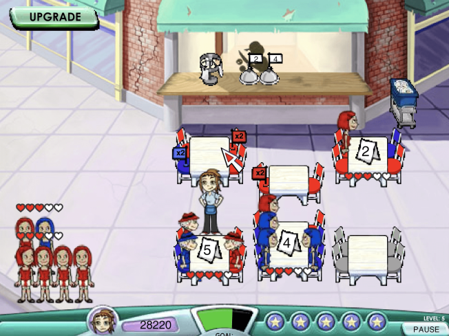

## Diner Dash Env



Diner Dash is a benchmark task for training reinforcement learning (RL) and imitation learning (IL) polices in the domain of high dimensional action space.

The player is running a restaurant by controlling a waitress to serve customers as many as possible. As shown in the picture,
the restaurant has 6 tables with different sizes and up to 7 waiting groups, on the left side and with different sizes, to be
served. For each group of people, the player needs to allocate a table for them, collect orders, submit orders, pick up food,
serve food, collect bills, clean table and finally return the dish to the dish collection point. There is a happiness value of each group of people, represented in the form of hearts, and the
happiness value will decrease if they wait too long. Once the happiness value reaches zero, the customer runs away, and the
player loses one star. There is a maximum of 5 stars of each player, and the game ends when the player loses five groups
of customers.

Diner Dash is a challenging task, with high dimensional action space, high
dimensional state space, infinite horizon, hierarchical structure
and requires sub-tasks to be completed in parallel. Such a
tough task gives a better training environment which is closer
to the real-world problems.

#### To Try with GUI

```
Drag the swf.html into the chrome broswer
OR
Open the DinerDash.swf directly.
```

#### To Install

```
pip install more_itertools
pip install gym
pip install -e DinerDashEnv
```


#### To Use

```
import gym

env = gym.make('diner_dash:DinerDash-v0').unwrapped
env.flash_sim = False

state = env.reset()
action = 1
state, reward, done, _ = env.step(action)

# Helper methods:
env.env.print() # inspect all states
env_tem = env.env.duplicate() # duplicate env for planning
```


#### State Space

```
# Size = (40,)

table1_status
table1_size
table1_hap
...
table6_status
table6_size
table6_hap

table_1_food : 0 not ready for collection, 1 : ready
...
table_6_food

group_1_hap
group_1_size
...
group_7_hap
group_7_size

hand_item1
hand_item2
```


#### Action Space

```
0 : None
1 : Move_T_1_A
2 : Move_T_2_A
3 : Move_T_3_A
4 : Move_T_4_A
5 : Move_T_5_A
6 : Move_T_6_A
7 : Move_Counter_A
8 : Pick_Food_1_A
9 : Pick_Food_2_A
10 : Pick_Food_3_A
11 : Pick_Food_4_A
12 : Pick_Food_5_A
13 : Pick_Food_6_A
14 : Move_Collection_A
15 : Pick_Seat_G1_T1_A
16 : Pick_Seat_G1_T2_A
17 : Pick_Seat_G1_T3_A
18 : Pick_Seat_G1_T4_A
19 : Pick_Seat_G1_T5_A
20 : Pick_Seat_G1_T6_A
21 : Pick_Seat_G2_T1_A
22 : Pick_Seat_G2_T2_A
23 : Pick_Seat_G2_T3_A
24 : Pick_Seat_G2_T4_A
25 : Pick_Seat_G2_T5_A
26 : Pick_Seat_G2_T6_A
27 : Pick_Seat_G3_T1_A
28 : Pick_Seat_G3_T2_A
29 : Pick_Seat_G3_T3_A
30 : Pick_Seat_G3_T4_A
31 : Pick_Seat_G3_T5_A
32 : Pick_Seat_G3_T6_A
33 : Pick_Seat_G4_T1_A
34 : Pick_Seat_G4_T2_A
35 : Pick_Seat_G4_T3_A
36 : Pick_Seat_G4_T4_A
37 : Pick_Seat_G4_T5_A
38 : Pick_Seat_G4_T6_A
39 : Pick_Seat_G5_T1_A
40 : Pick_Seat_G5_T2_A
41 : Pick_Seat_G5_T3_A
42 : Pick_Seat_G5_T4_A
43 : Pick_Seat_G5_T5_A
44 : Pick_Seat_G5_T6_A
45 : Pick_Seat_G6_T1_A
46 : Pick_Seat_G6_T2_A
47 : Pick_Seat_G6_T3_A
48 : Pick_Seat_G6_T4_A
49 : Pick_Seat_G6_T5_A
50 : Pick_Seat_G6_T6_A
51 : Pick_Seat_G7_T1_A
52 : Pick_Seat_G7_T2_A
53 : Pick_Seat_G7_T3_A
54 : Pick_Seat_G7_T4_A
55 : Pick_Seat_G7_T5_A
56 : Pick_Seat_G7_T6_A
```

